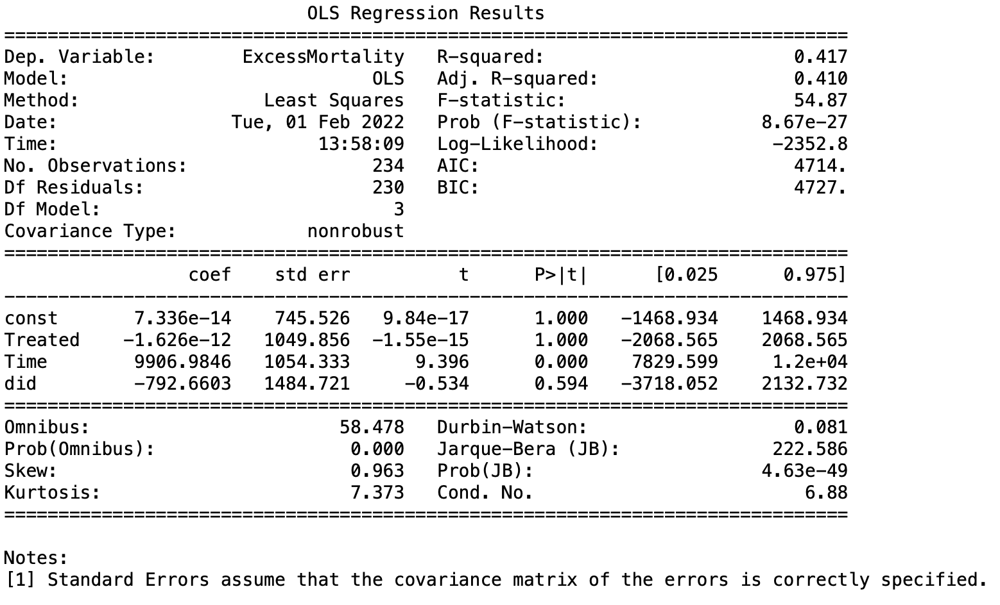

# The Effects of Government Stringency on Excess Mortality during the COVID-19 Pandemic

*Over the course of the last two years, COVID-19 has caused monumental disruptions to almost every aspect of life around the globe. Chief among them is an huge increase in the burden of disease, public health, and mortality. As governments around the world sprung into action to combat the rising case and death numbers, they took a wide variety of approaches. Politicians and citizens have hotly contested the pros and cons of these various approaches, and whether any individual intervention was worth the cost paid in a reduction in personal freedom, individuals social lives, mental health and well being, or potential economic impact. In this project, I take a first look at whether government stringency (the level of restrictiveness displayed across policy responses) had an effect on the mortality outcomes for that given country.*

## 1. Data

Beginning January 1st 2020, Oxford began collecting systematic information on policy measures different governments have taken to combat COVID-19. These indicators - which include travel restrictions, school closures, and health system policies among others - have been aggregated into a single number representing the degree of stringency witch which a given government responded to the pandemic. The original data set can be found here:

> * [Oxford COVID-19 Government Response Tracker](https://www.bsg.ox.ac.uk/research/research-projects/covid-19-government-response-tracker)

COVID-19 death numbers have been difficult to accurately track for a wide variety of reasons (improper accounting, lack of resources, differences in accounting methods, etc). However, a more reliable method for estimating the total toll COVID-19 has taken in terms of lives lost is excess mortality - the number of deaths from all causes measured during a crisis, above what could be observed under ‘normal’ conditions. However, not all countries officially track or report excess mortality. Fortunately, the Economist Intelligence Unit has created a country by country estimate, which can be found here:

> * [Economist Excess Mortality Tracker](https://www.economist.com/graphic-detail/coronavirus-excess-deaths-tracker)

## 2. Data Cleaning 

In a collaborative-filtering system there are only three columns that matter to apply the machine learning algorithms: the user, the item, and the explicit rating (see the example matrix above). I also had to clean & normalize all the reference information (location, difficulty grade, etc.) to the route so that my user could get a useful and informative recommendation.

* **Problem 1:** These data sets use a different name and date scheme to represent countries and entries. **Solution:** Convert the iso3c used by the Economist data set into the plain name country format of the Oxford data. Then, apply a standardized date and time format across both datasets.

* **Problem 2:** The two data sets cover slightly different dates and countries. **Solution:** Limit the period of time in question to the smaller range of the two, and remove countries not covered in both sources.

* **Problem 3:** The merged data set was sorted date rather than country. **Solution:** Sort the data set by country first and then by date.

## 3. EDA

The distribution of the Stringency looked nearly normal, but with a sharp increase in concentration at the lower bound (0 in this case). The excess mortality displayed very little normality, and there appeared to be a several relatively extreme outliers. Plotting various countries excess mortality against their stringency yielded some interesting results. There was a very clear pattern in mortality, which tended to increase relatively linearly over time (which is what you would expect). Stringency, however, had no such clear pattern with a wide variety of ranges and scores between countries. If you squinted, you may have been able to see a common few commonalities (a sharp increase near the beginning of 2020, some upward movement in response to the different waves of COVID-19, and a typically narrow range of stringency overall) but these were not consistent enough to establish a clear pattern. 

Ranking countries on stringency and excess mortality gave a brief overview of how countries fared relative to one another (who was strictest/most lenient, who have the highest excess mortality/lowest). Plotting these rankings did not display a clear pattern at first glance but revealed that there were indeed outliers, which I ultimately removed from the study.

## 4. Pre-processing

After looking into various methods to determine causation, and after consultation with my mentor, I decided that a diff-in-diff method would be an appropriate method. Accordingly, I developed aggregate scores for each country on the two metrics being considered (stringency and excess mortality). Somewhat unconventionally, I decided to create two distinct diff-in-diff models, one comparing the average against the most stringent countries, and one comparing the average against the least stringent. Accordingly, I split the countries and their scores into 3 quantiles based on stringency (high, middle, and low).

## 5. Modeling

Using the diff-in-diff with an OLS model, I compared my two treatment groups (high and low stringency) against my control (average).

The first model, comparing high stringency countries against average stringency stringency countries, showed a decrease in expected excess mortality in the treatment group. However, this result fails (by a fair margin) to be statistically significant.

>* The coef, 0.025, and 0.975 confidence for the variable "did" is primarily what were interested in here.

The second model, comparing a low stringency treatment group of countries and an average stringency control group, fared somewhat better. It too showed an expected decrease in excess mortality in the treatment group, with an coefficient of around -3917. This result also fails to reach statistical significance, but comes much closer.

>* The coef, 0.025, and 0.975 confidence for the variable "did" is primarily what were interested in here.

## 6. Analysis

With neither of the results reaching statistical significance, it is important not to put too much weight of the effect sizes found in the models. This is especially true in the case of high stringency, where the statistical power is much lower and the confidence interval ranges from a decrease in excess deaths to an increase. In the lower stringency group, we're given a somewhat clearer picture. At both ends of our confidence interval, we're seeing and overall decrease in excess mortality. While the result was not statistically significant, only slightly larger n would be required to reach significance. 

So, based on these results, I'm deeply uncertain whether high levels of stringency made positive or negative impacts on excess mortality during the course of the pandemic. I am lead to believe, however, that countries with a lower stringency than the average saw lower excess mortality rates than their peers.

It's also important that many features of the pandemic that were not explored here could have had large effects on this overall picture. Perhaps countries with milder outbreaks maintained a lower level of stringency, and the effect sizes we see are actually better explained by levels of infection within a country influencing government policy - rather than government policy influencing outcomes.

## 7. Future work

Since neither of these results were statistically significant, future analysis that increased the number of observations could potentially use a similar method to gain more confidence in the result. This could be done by in a variety of ways, perhaps by breaking countries down into smaller units (like states, regions, or counties). 

As mentioned in the analysis, a study that looks this problem from the opposite direction could yield interesting results. Perhaps the level of excess mortality actually influences government policy rather than the reverse and stringency could be better though of as a by product of pandemic severity in a given country rather than determining factor.

There are also many factors not examined here that could have more explanatory power on determining the level of excess mortality within a given country. A non-exhaustive list would include: GDP per capita, GINI coefficient, geographic factors, level of health infrastructure, experience with the SARS epidemic, and many others.

## 9. Credits

Thanks to Oxford University and the Economist Intelligence Unit for making this data publicly available for researchers, and to Kevin Ding for being an amazing sounding board and mentor.